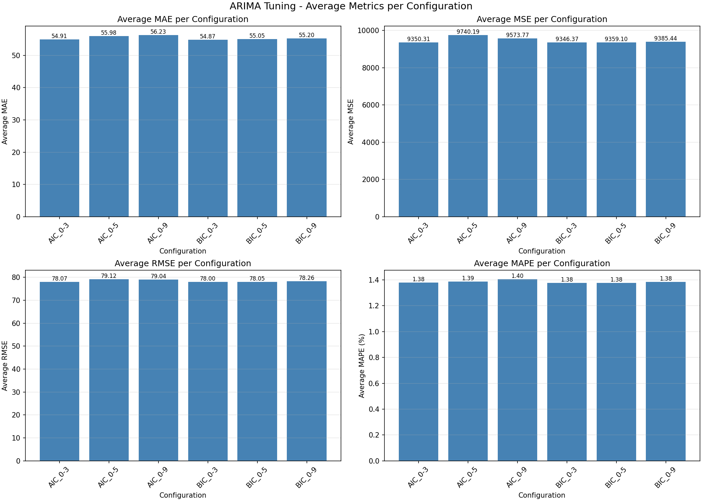

# ARIMA Tuning Comparison
Documentation of hyperparameter tuning experiments for the ARIMA model on daily stock price forecasting. The goal of this experiment is to test the model's sensitivity to hyperparameter choices, rather than to maximize absolute performance.

## 1. Parameters
ARIMA only has a few tunable hyperparameters because the order (p, d, q) is already selected automatically through a grid search. ARIMA is deterministic, which means the same input always produces the same output, so no need to set constant seed.

This experiment tests the following parameters:
| No | Parameter | Values Tested | Reason |
|---|---|---|---|
| 1 | Selection criterion | AIC, BIC | To test whether the choice of information criterion, AIC (favors prediction accuracy) vs BIC (penalizes model complexity more heavily), affects the selected orders and performance |
| 2 | Grid search range  | 0-3, 0-5, 0-9 | To test whether widening the search space beyond the standard practice finds better orders, or whether AIC/BIC penalties make it redundant |

Other parameters (ADF threshold = 0.05, maximum d = 2) are held fixed, following standard practice in comparable literatures and research papers.

## 2. Experiment Configurations
| Configuration | Information Criterion | p,q Range |
|---|---|---|
| AIC_0-3 | AIC | 0–3 |
| AIC_0-5 | AIC | 0–5 |
| AIC_0-9 | AIC | 0–9 |
| BIC_0-3 | BIC | 0–3 |
| BIC_0-5 | BIC | 0–5 |
| BIC_0-9 | BIC | 0–9 |

Each configuration is run across all 10 tickers using a (80% training/10% validation/10% testing) split.

## 3. Results by Configuration
### 3.1 Average Metrics per Configuration
| Configuration | MAE (avg) | MSE (avg) | RMSE (avg) | MAPE (avg) |
|---|---|---|---|---|
| AIC_0-3 | 54.9065 | 9350.3113 | 78.0731 | 1.3787 |
| AIC_0-5 | 55.9767 | 9740.1932 | 79.1188 | 1.3876 |
| AIC_0-9 | 56.2333 | 9573.7734 | 79.0394 | 1.4041 |
| BIC_0-3 | 54.8706 | 9346.3731 | 78.0035 | 1.3769 |
| BIC_0-5 | 55.0518 | 9359.102 | 78.0517 | 1.3777 |
| BIC_0-9 | 55.1984 | 9385.4374 | 78.2575 | 1.3834 |

### 3.2 Selected Orders per Configuration
This table shows whether different criteria / ranges select different orders.

| Ticker | AIC_0-3 | AIC_0-5 | AIC_0-9 | BIC_0-3 | BIC_0-5 | BIC_0-9 |
|---|---|---|---|---|---|---|
| ADRO | (0,1,3) | (0,1,5) | (4,1,9) | (0,1,3) | (0,1,5) | (0,1,9) |
| BBCA | (0,1,3) | (4,1,5) | (9,1,9) | (0,1,3) | (0,1,5) | (0,1,9) |
| BBNI | (2,1,3) | (4,1,5) | (0,1,9) | (0,1,3) | (0,1,5) | (0,1,9) |
| BBRI | (2,1,3) | (4,1,5) | (6,1,9) | (0,1,3) | (0,1,5) | (0,1,9) |
| BBTN | (3,0,3) | (3,0,5) | (3,0,9) | (1,0,3) | (1,0,5) | (1,0,9) |
| BMRI | (0,1,3) | (0,1,5) | (2,1,9) | (0,1,3) | (0,1,5) | (0,1,9) |
| ITMG | (1,1,3) | (5,1,5) | (2,1,9) | (1,1,3) | (1,1,5) | (0,1,9) |
| MEDC | (2,1,3) | (4,1,5) | (2,1,9) | (2,1,3) | (0,1,5) | (0,1,9) |
| PGAS | (3,0,3) | (3,0,5) | (1,0,9) | (1,0,3) | (1,0,5) | (1,0,9) |
| PTBA | (3,1,3) | (2,1,5) | (3,1,9) | (0,1,3) | (0,1,5) | (0,1,9) |

Runtime: 6641.778 seconds

### 3.3 Plot
The results produced by tuning can be compiled and summarised into a 2x2 plot:

## 4. Analysis
This is a brief analysis of the results produced by tuning.

### 4.1 Effect of Selection Criterion (AIC vs BIC)
Looking at the results, it can be said that BIC consistently uses simpler models or fewer terms in the (p,d,q) order, or more specifically the AutoRegressive order. In contrast, AIC tends to choose high-order models. For example, AIC_0-9 in ticker BBCA selected (9,1,9), whereas BIC_0-9 selected (0,1,9). This is expected since BIC has heavier complexity penalty compared to AIC. Despite the substantial differences in complexity, based on the average MAPE, the differences between the two selection criteria is negligible. With AIC's average MAPE ranging from 1.3787%-1.4041% and BIC's average MAPE ranging from 1.3769-1.3834. This shows that additional complexity added by AIC provided no major benefit in predicting future stock data.

### 4.2 Effect of Grid Search Range
Widening AIC's search range affects its choices in orders. AIC consistently selects orders nearer to the upper bound of the grid search range. The wide grid search range also increases the average MAPE scores, which might be caused by mild overfitting. On the other hand, BIC's selected orders remains stable and low across all ranges. BIC's MAPE remained essentially flat even when grid range is widened. This confirms that widening the grid search range provides no benefit and only consumes computing power and time.

### 4.3 Cross-Sector Consistency
From the results, it can be deduced that the specific sector ARIMA runs on does not have any meaningful effect, regardless the changes in selection criterion nor grid search range. Under BIC_0-3, the energy sector averaged 1.3344% MAPE and banking sector averaged 1.4193%, a difference of less than 0.1 point. Within sector variation (energy sector: ITMG 0.68%, MEDC 1.95%) exceeded the between-sector difference, confirming that per-ticker characteristics influenced forecasting error more than the sector. No configurations favored one sector over the other.

## 5. Conclusion
ARIMA performs generally the same, regardless of the changes made on selection criterion or grid search range. All six configurations produced an average MAPE within a narrow band of 1.3769%–1.4041%. Although accuracy wise, they stay relatively the same, testing shows that added complexity by AIC and wider grid search range added no benefit. Thus, it is recommended to use BIC_0-3, since it has similar and arguably a little better accuracy, without consuming that much computing power and time. These findings confirmed that daily stock prices are adequately modeled by low-order ARIMA and extensive hyperparameter tuning offers little benefit for this model.

## Raw Full Results
Complete raw results are available [here](results/ARIMA_tuning.csv).

| config | criterion | range | ticker | order | MAE | MSE | RMSE | MAPE |
|---|---|---|---|---|---|---|---|---|
| AIC_0-3 | AIC | 0-3 | ADRO | (0,1,3) | 31.922462920338496 | 2086.3618634906197 | 45.676710296283595 | 1.7431783818775721
| AIC_0-3 | AIC | 0-3 | BBCA | (0,1,3) | 97.99757209903514 | 17546.00446318597 | 132.4613319545971 | 1.1928873109664544
| AIC_0-3 | AIC | 0-3 | BBNI | (2,1,3) | 57.17924574127738 | 6262.386416944267 | 79.13524130843518 | 1.3531915660413179
| AIC_0-3 | AIC | 0-3 | BBRI | (2,1,3) | 53.29266017133074 | 4993.202426942105 | 70.66259567085054 | 1.3786749477157687
| AIC_0-3 | AIC | 0-3 | BBTN | (3,0,3) | 23.107211436004757 | 1051.8532077721466 | 32.43228650237517 | 1.9023651009577343
| AIC_0-3 | AIC | 0-3 | BMRI | (0,1,3) | 60.72496866564123 | 6581.310563177312 | 81.12527696826257 | 1.2947887271305207
| AIC_0-3 | AIC | 0-3 | ITMG | (1,1,3) | 153.52071414627505 | 50513.69099315388 | 224.75251053804467 | 0.6796893422618242
| AIC_0-3 | AIC | 0-3 | MEDC | (2,1,3) | 25.672566659719237 | 1218.4683560411754 | 34.90656608778892 | 1.9461704263332074
| AIC_0-3 | AIC | 0-3 | PGAS | (3,0,3) | 23.434931549364215 | 1110.8870549937283 | 33.32997232212664 | 1.3718975679062393
| AIC_0-3 | AIC | 0-3 | PTBA | (3,1,3) | 22.213000127184927 | 2138.9473956943025 | 46.24875561238705 | 0.924294092219732
| AIC_0-5 | AIC | 0-5 | ADRO | (0,1,5) | 31.90822597025865 | 2094.0484993804594 | 45.76077468072912 | 1.7430492833605913
| AIC_0-5 | AIC | 0-5 | BBCA | (4,1,5) | 98.54696221085587 | 17730.777100036765 | 133.15696414396345 | 1.1997284535591974
| AIC_0-5 | AIC | 0-5 | BBNI | (4,1,5) | 57.91830113416273 | 6392.785999930095 | 79.95489978688045 | 1.3707325837622508
| AIC_0-5 | AIC | 0-5 | BBRI | (4,1,5) | 53.66271787294426 | 5150.196996035982 | 71.76487299533095 | 1.3892979590453143
| AIC_0-5 | AIC | 0-5 | BBTN | (3,0,5) | 23.1109015487384 | 1060.663450542049 | 32.56782845911052 | 1.9017854053264975
| AIC_0-5 | AIC | 0-5 | BMRI | (0,1,5) | 60.381423725302675 | 6554.607804589128 | 80.96053238825155 | 1.2872467851117004
| AIC_0-5 | AIC | 0-5 | ITMG | (5,1,5) | 162.30430796211667 | 53928.87299017086 | 232.22590938603483 | 0.719025251712471
| AIC_0-5 | AIC | 0-5 | MEDC | (4,1,5) | 25.717546410887053 | 1240.5916796478962 | 35.22203400781812 | 1.9472533930813347
| AIC_0-5 | AIC | 0-5 | PGAS | (3,0,5) | 23.428208287986177 | 1111.0027016086556 | 33.33170715112947 | 1.371291808101405
| AIC_0-5 | AIC | 0-5 | PTBA | (2,1,5) | 22.788874692111392 | 2138.384738190376 | 46.242672264807275 | 0.9470785886830196
| AIC_0-9 | AIC | 0-9 | ADRO | (4,1,9) | 32.14602810776921 | 2124.558472958721 | 46.09293300451514 | 1.753754923315754
| AIC_0-9 | AIC | 0-9 | BBCA | (9,1,9) | 101.01287753509993 | 18269.7056535544 | 135.16547507982355 | 1.2300557122693818
| AIC_0-9 | AIC | 0-9 | BBNI | (0,1,9) | 57.68780496983234 | 6354.3333690925265 | 79.71407259130929 | 1.3650945840997846
| AIC_0-9 | AIC | 0-9 | BBRI | (6,1,9) | 54.66517566977302 | 5172.077888730111 | 71.91715990450479 | 1.4178918048741667
| AIC_0-9 | AIC | 0-9 | BBTN | (3,0,9) | 23.357368999414014 | 1074.8174036238013 | 32.78440793462345 | 1.9224701531005508
| AIC_0-9 | AIC | 0-9 | BMRI | (2,1,9) | 61.98923884992535 | 6869.661976152534 | 82.88342401320384 | 1.320761127838619
| AIC_0-9 | AIC | 0-9 | ITMG | (2,1,9) | 157.95107490145654 | 51339.24237854081 | 226.581646164337 | 0.6997005272838872
| AIC_0-9 | AIC | 0-9 | MEDC | (2,1,9) | 25.687258702983083 | 1245.9262322756729 | 35.29768026762768 | 1.9454064395910866
| AIC_0-9 | AIC | 0-9 | PGAS | (1,0,9) | 23.357112738457474 | 1104.9440001336177 | 33.24069794895435 | 1.3694120580907898
| AIC_0-9 | AIC | 0-9 | PTBA | (3,1,9) | 24.479129665947283 | 2182.4669222231123 | 46.71688048471465 | 1.0162450710626305
| BIC_0-3 | BIC | 0-3 | ADRO | (0,1,3) | 31.922462920338496 | 2086.3618634906197 | 45.676710296283595 | 1.7431783818775721
| BIC_0-3 | BIC | 0-3 | BBCA | (0,1,3) | 97.99757209903514 | 17546.00446318597 | 132.4613319545971 | 1.1928873109664544
| BIC_0-3 | BIC | 0-3 | BBNI | (0,1,3) | 57.0181484730441 | 6314.949777554947 | 79.46665827600243 | 1.349094618742253
| BIC_0-3 | BIC | 0-3 | BBRI | (0,1,3) | 53.02339926766607 | 4967.273417931531 | 70.47888632726493 | 1.3723709936096409
| BIC_0-3 | BIC | 0-3 | BBTN | (1,0,3) | 22.924974742758216 | 1040.54639083391 | 32.25750131107352 | 1.8873329839385662
| BIC_0-3 | BIC | 0-3 | BMRI | (0,1,3) | 60.72496866564123 | 6581.310563177312 | 81.12527696826257 | 1.2947887271305207
| BIC_0-3 | BIC | 0-3 | ITMG | (1,1,3) | 153.52071414627505 | 50513.69099315388 | 224.75251053804467 | 0.6796893422618242
| BIC_0-3 | BIC | 0-3 | MEDC | (2,1,3) | 25.672566659719237 | 1218.4683560411754 | 34.90656608778892 | 1.9461704263332074
| BIC_0-3 | BIC | 0-3 | PGAS | (1,0,3) | 23.298972526828898 | 1093.0233905579253 | 33.06090426104412 | 1.3646059388715304
| BIC_0-3 | BIC | 0-3 | PTBA | (0,1,3) | 22.602691346442715 | 2102.101497257675 | 45.84868043093143 | 0.9385850095790198
| BIC_0-5 | BIC | 0-5 | ADRO | (0,1,5) | 31.90822597025865 | 2094.0484993804594 | 45.76077468072912 | 1.7430492833605913
| BIC_0-5 | BIC | 0-5 | BBCA | (0,1,5) | 97.94820412775881 | 17526.611712000977 | 132.38811016099964 | 1.192193123019978
| BIC_0-5 | BIC | 0-5 | BBNI | (0,1,5) | 57.33529333407151 | 6351.2141310819825 | 79.69450502438661 | 1.3568216151232175
| BIC_0-5 | BIC | 0-5 | BBRI | (0,1,5) | 53.30535481261404 | 4954.6569887987125 | 70.38932439510066 | 1.3799653134855232
| BIC_0-5 | BIC | 0-5 | BBTN | (1,0,5) | 23.0095213862834 | 1043.8419601896892 | 32.30854314557822 | 1.8944478531644104
| BIC_0-5 | BIC | 0-5 | BMRI | (0,1,5) | 60.381423725302675 | 6554.607804589128 | 80.96053238825155 | 1.2872467851117004
| BIC_0-5 | BIC | 0-5 | ITMG | (1,1,5) | 155.29267083783247 | 50641.167310939796 | 225.03592448971295 | 0.6874818560950939
| BIC_0-5 | BIC | 0-5 | MEDC | (0,1,5) | 25.614967602745125 | 1222.1677847870153 | 34.959516369466776 | 1.9418230845478774
| BIC_0-5 | BIC | 0-5 | PGAS | (1,0,5) | 23.236705896050307 | 1099.5074501833208 | 33.15882160426273 | 1.3601721647776914
| BIC_0-5 | BIC | 0-5 | PTBA | (0,1,5) | 22.4859257747023 | 2103.1962440367774 | 45.860617571471685 | 0.9337186983989217
| BIC_0-9 | BIC | 0-9 | ADRO | (0,1,9) | 31.936552219898967 | 2108.148067646851 | 45.91457358668216 | 1.7438602487503567
| BIC_0-9 | BIC | 0-9 | BBCA | (0,1,9) | 98.27714298806389 | 17613.372489029694 | 132.71538150881267 | 1.196184740094612
| BIC_0-9 | BIC | 0-9 | BBNI | (0,1,9) | 57.68780496983234 | 6354.3333690925265 | 79.71407259130929 | 1.3650945840997846
| BIC_0-9 | BIC | 0-9 | BBRI | (0,1,9) | 53.349138960474505 | 4965.098227051102 | 70.4634531303363 | 1.3813856731442409
| BIC_0-9 | BIC | 0-9 | BBTN | (1,0,9) | 23.20441274685169 | 1058.759878655901 | 32.53859060647681 | 1.9092649140184204
| BIC_0-9 | BIC | 0-9 | BMRI | (0,1,9) | 60.83493854668537 | 6629.513643377683 | 81.42182535031797 | 1.2960322094440224
| BIC_0-9 | BIC | 0-9 | ITMG | (0,1,9) | 154.9688277719452 | 50634.47411629078 | 225.02105260684118 | 0.6860366480618421
| BIC_0-9 | BIC | 0-9 | MEDC | (0,1,9) | 25.661978002165416 | 1242.8779809563287 | 35.25447462317838 | 1.9427348267971138
| BIC_0-9 | BIC | 0-9 | PGAS | (1,0,9) | 23.357112738457474 | 1104.9440001336177 | 33.24069794895435 | 1.3694120580907898
| BIC_0-9 | BIC | 0-9 | PTBA | (0,1,9) | 22.705961502578937 | 2142.8522253826013 | 46.29095187380144 | 0.9440842773457759
